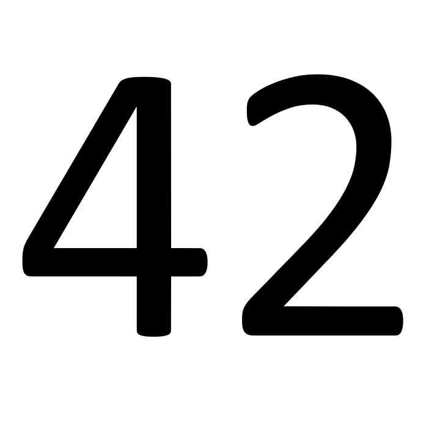

# Ishihara-test-creator

## Dependencies
`python 3.6+`, `pygame`
 
## Instructions
* Open colourblind_gui.py and change Dots args to edit the pattern created
* Run colourblind_gui.py
## Example

Made using: `Dots(800, 10, 5, 3)`


## Using Dots class
The image that is read from should look like:


And should be:
* Uncompressed to ensure all pixels are a definite colour
* Anything to be output with different colour should be black `(0, 0, 0)`
* Dimensions should be square e.g 720x720 as used in example

When not using the gui:
* Specify graph function
* Specify radius
  * Needs to be image width / 2
```python
dots = Dots(2000, 7, 2, choice, func=lambda x1, y1: 350 < x1 + y1 < 1000, radius=500)
```
This would need an image size of 1000x1000 and would draw within the area of the function
